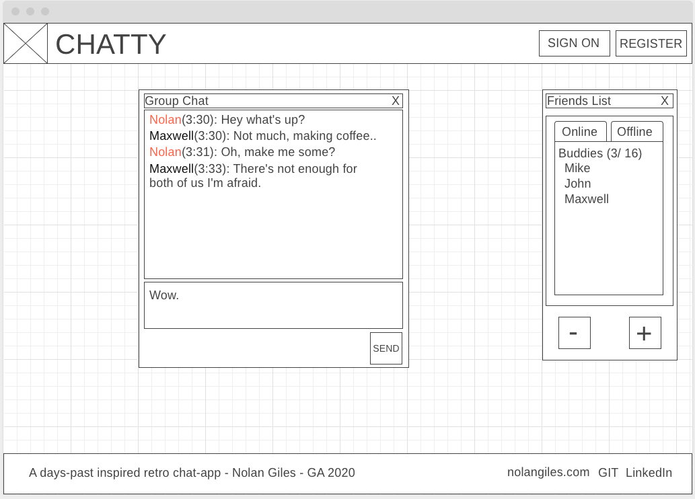
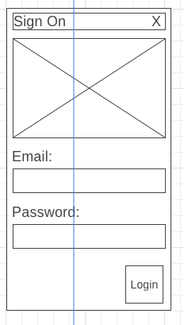
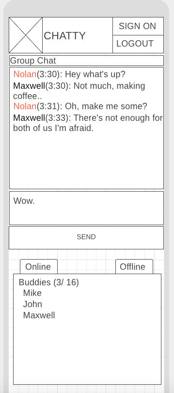
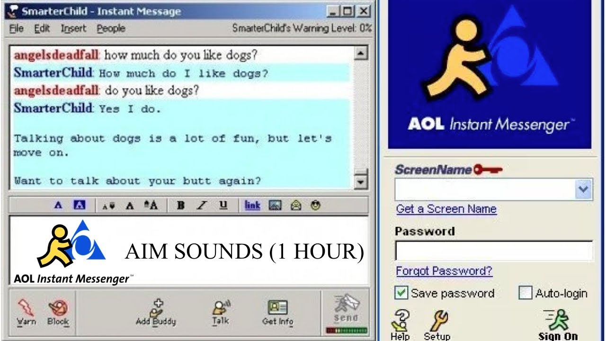
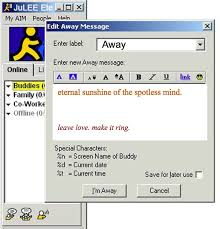
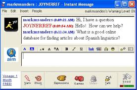
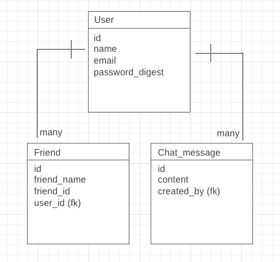

# Full Stack Chat Application Project (Chatty)


- [Full Stack Project](#Full-Stack-Project)
  - [Overview](#Overview)
    - [Team Members](#Team-Members)
  - [MVP](#MVP)
    - [MVP Goals](#MVP-Goals)
    - [MVP Libraries](#MVP-Libraries)
    - [MVP Client (Front End)](#MVP-Client-Front-End)
      - [Wireframes](#Wireframes)
      - [Component Hierarchy](#Component-Hierarchy)
      - [Component Breakdown](#Component-Breakdown)Í
      - [Component Estimates](#Component-Estimates)
    - [MVP Server (Back End)](#MVP-Server-Back-End)
      - [ERD Model](#ERD-Model)
      - [Data Heirarchy](#Data-Heirarchy)
  - [Post-MVP](#Post-MVP)
  - [Project Delivery](#Project-Delivery)
  - [Code Showcase](#Code-Showcase)
  - [Code Issues & Resolutions](#Code-Issues--Resolutions)


<br>

## Overview

**Chatty** is a fullstack application that replicates a now "retro" messenger system.  From a Ruby/Rails/Sqlite DB backend to power the login, authentication, friends lists and chat message logs.  To the React based frontend styling a retro AIM-like (AOL Instant Messenger) design for clients to connect to._

### Team Member(s)

Created, designed, and developed by Nolan Giles (November '19 General Assembly SEI Cohort) Unit 4 Project. 


<br>

## MVP


The **Chatty** MVP will allow users to connect via React front-end using a Registration system of email/name/password and login using email/password. It will prevent duplicate registrations and utilize a token-based local-login storage for persistence. As well as a fully bcrypt hashed password for security.
Users will be able to have a personalized friend/buddy list and add/remove friends. Users will be able to access a general chat-room allowing them to talk with everyone. Full CRUD showcasing in the following features: Creating: Friends/Users/Messages, Receiving: Messages and Online Users, Updating: Usernames & Deleting: Friends.

<br>

### MVP Goals

- _3 Modeled tables: users/ friends / chat_messages_
- Full CRUD showcasing in the following features: Creating: Friends/Users/Messages, Receiving: Messages and Online Users, Updating: Usernames & Deleting: Friends.
- Fully functioning friend list allowing additions and removals.
- Functioning Chatroom capable of housing and displaying all messages as well as providing a brief log of most recent said messages upon login.

### Stretch Goals
- Sounds (door closing on friend-logout, door opening on friend-login, "welcome" on sign-in)
- Direct messaging! 1 to 1 messaging between friends.
- DRAGGABLE WINDOWS - probably not happening!
- Better styling, really trying to hit that 1:1 repoduction!
- A flip switch to toggle design from old to modern - suggestion from uxdi designer
- EMOJIS!
- ANIMATED EMOJIS
- Away messages
- Custom Group Chats?

<br>

### MVP Libraries

|     Library      | Description                                |
| :--------------: | :----------------------------------------- |
|      React       | To manage and control the View/Frontend. |
|   actioncable   | _Creates and controls Socket connections in both Rails and React_ |
| Ruby/Rails | _Powers & controls the backend SQLite3 database and manages endpoints for API_ |
|     axios      | _package for sending/receiving html requests from react to the API server_ |


<br>

### MVP Client (Front End)

#### Wireframes


Desktop Landing



Login



Mobile



Reference Images

1



2



3




<br>

#### Component Hierarchy


``` structure
public
|__ images/
src
|__ components/
      |__ Header.js
      |__ Footer.js
      |__ Chat.js
      |__ Modal.js
      |__ Window.js
      |__ LoginForm.js
      |__ RegisterForm.js
      |__ FriendsList.js
|__ services/
      |__ api_helper.js
```

#### Component Breakdown


|  Component   |    Type    | state | props | Description                                                      |
| :----------: | :--------: | :---: | :---: | :--------------------------------------------------------------- |
|    Header    | functional |   y   |   y   | _The header will contain the logo as well as Login/Registration buttons and forms (technically)._               |
|  Footer  | functional |   n   |   n   | _Just some info about me and the project with external links_       |
|   Chat    |   class    |   y   |   y   | _Powerhouse component powering chat and managing sockets_      |
| Window | functional |   n   |   y   | _Simplistic component to house top-bar ui style_                 |
|    LoginForm    | class |   y   |   y   | _Form for logging in "Signing On"_ |
|    RegistrationForm    | class |   y   |   y   | _Form for registering_ |
|    Modal    | functional |   n   |   y   | _Houses framework for creating modals and displays children_ |
|    Friendslist    | class |   y  |   y   | _contain function for displaying friends list Ui element_ |


#### Component Estimates


| Task                | Priority | Estimated Time | Time Invested | Actual Time |
| ------------------- | :------: | :------------: | :-----------: | :---------: |
| Forms    |    L     |     1 hrs      |     1 hrs     |    1 hrs    |
| Create CRUD Actions |    H     |     6 hrs      |     8 hrs     |     TBD     |
| Chat |    H     |     8 hrs      |     5 hrs     |     TBD     |
| Window |    L     |     1 hrs      |     0 hrs     |     TBD     |
| UI styling |    H     |     20 hrs      |     4 hrs     |     TBD     |
| friendsList |    H     |     5 hrs      |     0 hrs     |     TBD     |
| TOTAL               |          |     41 hrs      |     18 hrs     |     TBD     |


<br>

### MVP Server (Back End)

#### ERD Model



#### Data Heirarchy


``` structure

database_db
|__ users/
|__ chat_messages/
|__ friends/

```

<br>

***

## Post-MVP

> Use this section to document ideas you've had that would be fun (or necessary) for your Post-MVP. This will be helpful when you return to your project after graduation!

***

## Project Delivery

> The Delivery section should be expanded and revised as you work on your project.

## Code Showcase

> Use this section to include a brief code snippet of functionality that you are proud of and a brief description.

## Code Issues & Resolutions

> Use this section to list of all major issues encountered and their resolution, if you'd like.

***